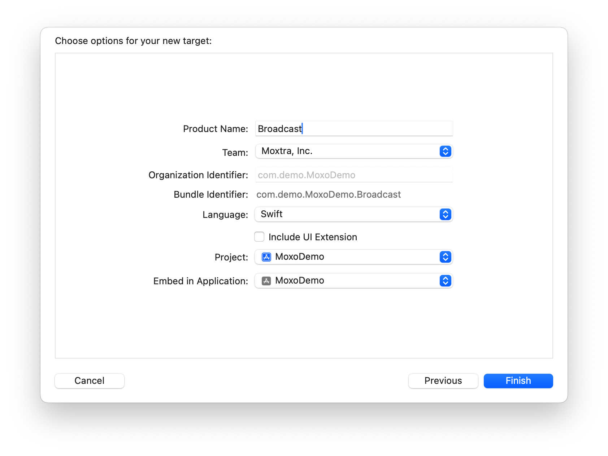
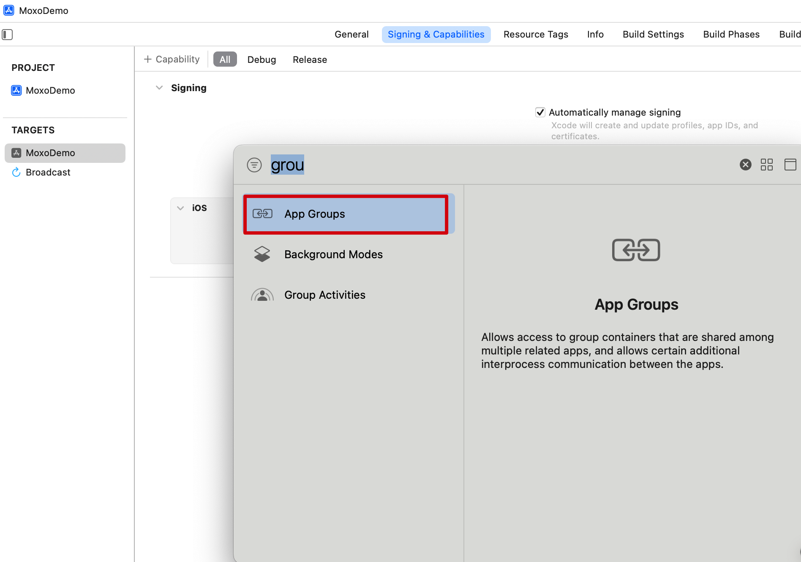

By default Moxo iOS SDK supports in-app screenshare during meeting, but it only works when app in foreground.
If you wish to share contents from other apps or screen, a broadcast upload extension is required. Refer more replaykit details in [apple documentation](https://developer.apple.com/documentation/replaykit)

## Moxo Broadcast Flow

* Moxo SDK will pull up broadcast when user click sahre screen button  

* Then broadcast extension will receive start callback (broadcastStarted:)
* Extension commiuncate with app in a share tunnel
* When App got video sample, convert to image
* Post the image to Moxo SDK to upload to Moxo server

## Setup Broadcast

### Add a new target: Broadcast Upload Extension




* UI extension is not required.

### Add App Groups
UserDefaults can be shared between app and its extension in same App Group.  
In this instruction, we will leverage UserDefaults as a shared tunnel for easy understanding. You can use other app communication solution also.

* Add App Group:
In Xcode -> {Your app target} -> Sigining & Capabilities -> App Groups


* 'Broadcast' extension also need to add 'App Groups' capabilities.
* Give same app group id to both App and broadcast targets.

### Code 

#### In the main app
* Moxo SDK has a singleton ```MEPBroadcasting```, it can control sharing, post images.
* In your app, assign a delegate to ```MEPBroadcasting.sharedInstance()```.
* Assign your broadcast extension bundle id to         ```MEPBroadcasting.sharedInstance().broadcastExtensionBundleIdentifier```
* Implement ```MEPBroadcastingDelegate```
* Read UserDefaults from app group
* Add observer on UserDefaults to respond to change
* When got sample updates, convert to image
* Call ```MEPBroadcasting.sharedInstance().share(image)``` to post image
* Refer [BroadcastManager.swift](https://github.com/Moxtra/moxo-mep-ios-sample-v8/blob/main/MoxoDemo/MoxoDemo/Broadcast/BroadcastManager.swift) for more details

#### In the broadcast extension
* When ```broadcastStarted``` triggered, tell main app screenshare start with UserDefaults
* When ```processSampleBuffer``` triggered, save video sample to UserDefaults
* Set up schedule timers to post video sample and sync screenshare state from main app
* Refer [SampleHandler.swift](https://github.com/Moxtra/moxo-mep-ios-sample-v8/blob/main/MoxoDemo/Broadcast/SampleHandler.swift) for more details
